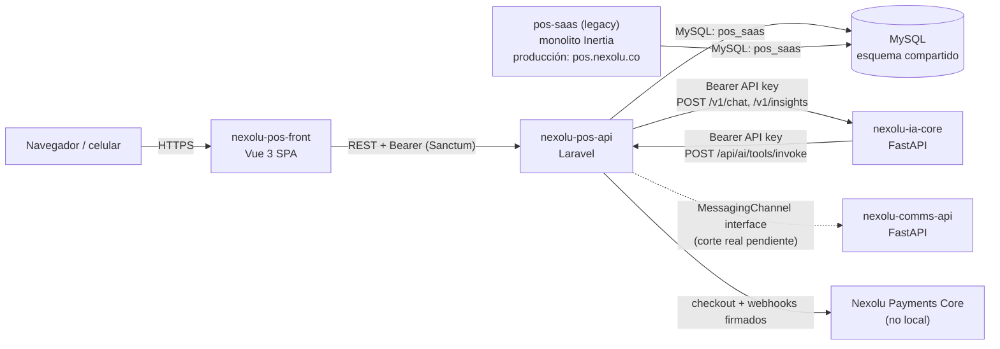

# nexolu-utils

Punto de entrada para entender el ecosistema de Nexolú y sumarte a la
migración del monolito legacy a una arquitectura API-first. Si sos nuevo en
el proyecto, empezá por acá antes de tocar cualquier repo.

## Qué es Nexolú

Nexolú es un POS (punto de venta) SaaS para negocios colombianos - tiendas,
restaurantes/cafés, salones de belleza, y combinaciones de eso. Multi-
tenant (`Business` es la entidad raíz), multi-vertical (un mismo negocio
puede tener venta de productos, cuentas abiertas/mesas, servicios con
agenda, todo a la vez, activado por `feature_flags`).

## Por qué esta migración

El producto original (`pos-saas`, ver abajo) es un monolito Laravel +
Inertia + Vue: un solo repo, backend y frontend acoplados, sin API real. Se
está migrando **módulo por módulo** a:

- Un backend API-first (`nexolu-pos-api`) que sirve JSON puro, pensado para
  tener múltiples clientes (el SPA nuevo, apps móviles a futuro, otros
  servicios).
- Un frontend nuevo desacoplado (`nexolu-pos-front`), SPA pura sin SSR/
  Inertia, que consume esa API.
- Servicios transversales reutilizables por **todos** los productos de
  Nexolú (no solo el POS) en vez de código duplicado por producto:
  `nexolu-ia-core` (IA), `nexolu-comms-api` (WhatsApp/email), y Nexolu
  Payments Core (cobros).

Es una migración **en vivo**: el monolito sigue en producción mientras se
construye lo nuevo, así que durante toda la transición el backend nuevo y
el monolito comparten la misma base de datos MySQL (mismo esquema, mismos
datos reales) - no hay una migración de datos "big bang", el corte es
gradual, feature por feature.

## Mapa de repos

Cada repo tiene mas descripción en su propio readme.

| Repo | Qué es | Stack | Estado |
|---|---|---|---|
| [`nexolu-pos-api`](https://github.com/mattchaparro/nexolu-pos-api) | Backend nuevo, API-first | Laravel 13, PHP 8.4, MySQL, Redis | En migración activa - ver `docs/MIGRATION_BACKLOG.md` ahí |
| [`nexolu-pos-front`](https://github.com/mattchaparro/nexolu-pos-front) | Frontend nuevo, SPA | Vue 3, Vite, Pinia, TanStack Query, Tailwind v4, PrimeVue | En migración activa - ver `docs/BACKEND_READINESS.md` ahí |
| [`nexolu-ia-core`](https://github.com/mattchaparro/nexolu-ia-core) | Asistente de IA, compartido por todos los productos Nexolú (no solo POS) | Python, FastAPI, SQLAlchemy async, Alembic | Servicio nuevo, ya integrado con el POS |
| [`nexolu-comms-api`](https://github.com/mattchaparro/nexolu-comms-api) | Envío de WhatsApp/email, compartido por todos los productos | Python, FastAPI, SQLAlchemy async, Alembic | Servicio nuevo, interfaces del lado del POS ya listas, corte real pendiente |
| [nexolu-payments-core](https://github.com/mattchaparro/nexolu-payments-core) | Cobros de suscripción (Wompi), compartido por todos los productos | (no clonado localmente todavía) | Ya integrado con el POS (checkout de suscripción) |
| `pos-saas` (GitLab: `gitlab.com:mattchaparrof/pos-saas`) | **El monolito legacy, todavía en producción** (`pos.nexolu.co`) | Laravel 10 + Inertia + Vue 3 | Fuente de verdad de lo que hay que migrar - se va reduciendo módulo por módulo |
| `pos-saas-legacy` (GitHub, snapshot local) | Copia de referencia del monolito (un solo commit, para no depender de acceso a GitLab) | igual que `pos-saas` | Solo lectura, para consultar código/`CONTEXT.md`/`ARCHITECTURE.md` |
| `nexolu-utils` (este repo) | Documentación de arquitectura + herramientas de desarrollo local | - | - |

Todos, salvo el monolito, se clonan como **hermanos** en el mismo
directorio padre - ver `build/README.md` para el setup local completo.

## Cómo se comunican los servicios

### Frontend ↔ Backend

`nexolu-pos-front` habla **solo** con `nexolu-pos-api`, por REST puro (sin
Inertia/SSR). Login vía `POST /api/v1/login` (Sanctum), token Bearer en
cada request siguiente (`src/services/http/client.ts`). El monolito legacy
sirve su propio frontend Inertia contra sus propias rutas - son dos
frontends completamente separados que, durante la migración, conviven
apuntando a bases de código de backend distintas (uno al monolito, otro a
`nexolu-pos-api`) pero **la misma base de datos**.

### Backend nuevo ↔ monolito legacy: la misma base de datos

`nexolu-pos-api` **nunca corre migraciones de Laravel**. Su esquema (85
tablas) viene de un dump (`database/legacy-schema/schema.sql`) del mismo
esquema que usa el monolito, cargado una sola vez. En producción, ambas
apps leen/escriben la **misma base MySQL real** - por eso `nexolu-pos-api`
tiene un `docs/CUTOVER_TODO.md`: problemas de datos que solo se pueden
arreglar cuando el monolito deje de tocar esa tabla (si se arregla antes,
el monolito reintroduce la inconsistencia en su próximo write). Ver ese
archivo antes de tocar cualquier dato compartido.

### Backend ↔ nexolu-ia-core: relación en dos sentidos

No es una llamada simple - es un ida y vuelta:

1. El POS llama a `nexolu-ia-core` (`POST /v1/chat`, autenticado con una
   API key propia de la app `pos`) para el chat del Asistente y los
   insights del dashboard.
2. `nexolu-ia-core` **no toca ninguna base de datos de negocio** - cuando
   el modelo de IA necesita un dato real o ejecutar una acción, el Core le
   pega de vuelta al POS: `POST {base_url}/api/ai/tools/invoke`, con el
   nombre de la herramienta (`ventas_resumen`, `crear_gasto`, ...) y sus
   argumentos. El catálogo de herramientas y sus permisos vive en
   `App\Capabilities` del lado del POS - los nombres de las herramientas
   viajan en español a propósito (contrato compartido entre los dos
   repos), aunque las clases que las implementan estén en inglés.
3. Las escrituras (`crear_gasto`, etc.) nunca se ejecutan solas: generan un
   borrador (`AiDraft`, vive en `nexolu-ia-core`) que el usuario confirma
   explícitamente desde el POS o por WhatsApp Flow.

Esto es lo que hace que `nexolu-ia-core` sea reutilizable por **cualquier**
producto de Nexolú (Spa, EasyTickets, ...): el Core no sabe nada de
negocio, cada app le expone su propio catálogo de herramientas.

### Backend ↔ nexolu-comms-api: interfaces listas, corte pendiente

El envío de WhatsApp/email del POS ya está detrás de dos interfaces
(`App\Services\Messaging\Contracts\MessagingChannel` y
`MessagingCostReporter`) en vez de llamar directo a la API de Meta. Hoy la
única implementación real sigue siendo `WhatsAppCloudClient` (llamada
directa a Meta) - migrar el envío real a pasar por `nexolu-comms-api` es
escribir una clase nueva que implemente esas interfaces y cambiar dos
bindings en `AppServiceProvider`, sin tocar ningún consumidor (jobs,
comandos). Ver "Abstracción de mensajería" en
`nexolu-pos-api/docs/MIGRATION_BACKLOG.md`.

### Backend ↔ Nexolu Payments Core

El checkout de suscripción del POS ya no habla con Wompi directo: crea una
orden pendiente y llama a Payments Core (`POST /v1/payments/intents`);
Payments Core confirma por webhook firmado (`X-Nexolu-Signature`/
`X-Nexolu-Timestamp`, mismo esquema HMAC que usa `nexolu-comms-api` para
sus propios webhooks entrantes). Ya migrado, no corre local todavía (no
hace falta para desarrollar el resto).

## Convenciones que cruzan todos los repos

- **Idioma**: identificadores de código (clases, variables, nombres de
  archivo) siempre en inglés. Texto de cara al usuario (UI, mensajes,
  nombres de herramientas de IA) en español. Respuestas de un agente de IA
  al humano, en español. Comentarios de código pueden ir en español.
- **`business_id` es la unidad de aislamiento** en todo lo que toca al POS
  - nunca asumir una sola vertical (tienda/restaurante/salón) ni que una
    feature está disponible sin chequear `feature_flags`.
- Cada repo tiene su propio `CLAUDE.md` con las reglas específicas de ese
  repo (convenciones de código, qué no tocar, cómo correr tests). Leerlo
  siempre antes de trabajar ahí - este README da el contexto de conjunto,
  no reemplaza esas reglas puntuales.
- `nexolu-pos-api/docs/CUTOVER_TODO.md`: deuda de datos que solo se puede
  pagar retirando el monolito - no tocar sin confirmar que el monolito ya
  no escribe esa tabla.
- `nexolu-pos-api/docs/MIGRATION_BACKLOG.md`: qué falta migrar del
  monolito (jobs programados, módulos completos) y qué bloquea cada cosa.
- `nexolu-pos-front/docs/BACKEND_READINESS.md`: antes de empezar un módulo
  nuevo de frontend, revisar si el backend ya lo tiene listo.

## Levantar todo en local

Ver [`build/README.md`](build/README.md) - un solo script
(`build/start_local_pos.sh`) levanta los 4 servicios (Laravel Sail +
2 FastAPI + Vite) y expone la API y el frontend por túneles de Cloudflare
para poder abrir el frontend desde el celular.

## Para nuevos contribuyentes

1. Leé este README completo antes de tocar código.
2. Pedí acceso a los repos de GitHub listados arriba (y a GitLab si vas a
   necesitar consultar `pos-saas`, el monolito real en producción).
3. Seguí `build/README.md` para levantar todo en local.
4. Antes de trabajar en un repo puntual, leé su `CLAUDE.md` - tiene las
   reglas de ese repo específicamente (convenciones, qué no romper, cómo
   correr sus tests).
5. Si vas a migrar un módulo del monolito: revisá primero
   `nexolu-pos-api/docs/MIGRATION_BACKLOG.md` (si ya está listado, seguí
   ahí el estado) y `docs/CUTOVER_TODO.md` (si tu módulo toca una tabla
   compartida con el monolito, leé eso antes de "arreglar" un dato).
6. Si usás Claude Code (u otro agente) para las tareas: dale el contexto de
   este README primero (o pedile que lo lea) antes de pedirle que
   implemente algo - así entiende qué repo migra qué, y por qué ciertas
   cosas (compartir la base de datos con el monolito, no correr
   migraciones en `nexolu-pos-api`, no "arreglar" datos de
   `CUTOVER_TODO.md`) son decisiones deliberadas y no bugs a corregir.
